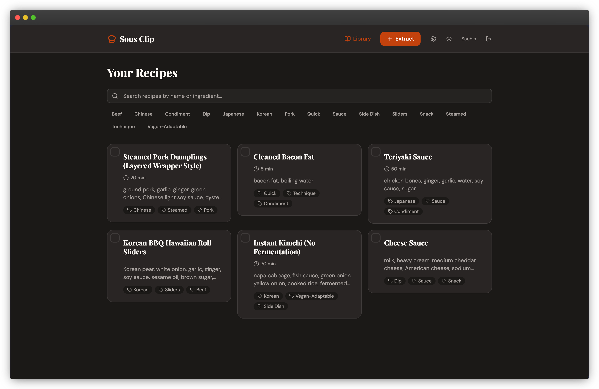
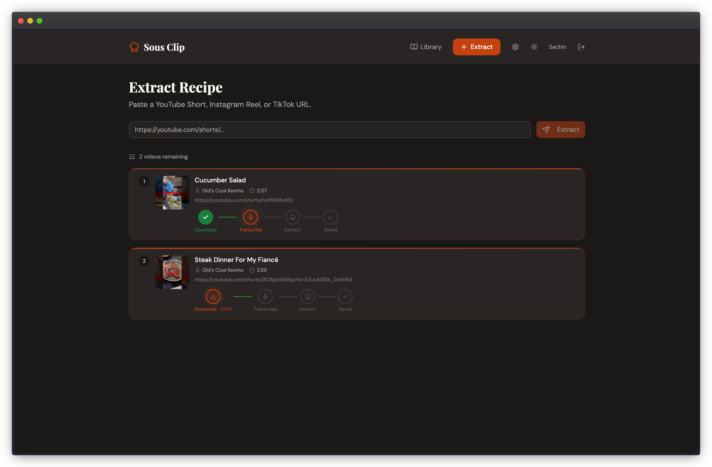
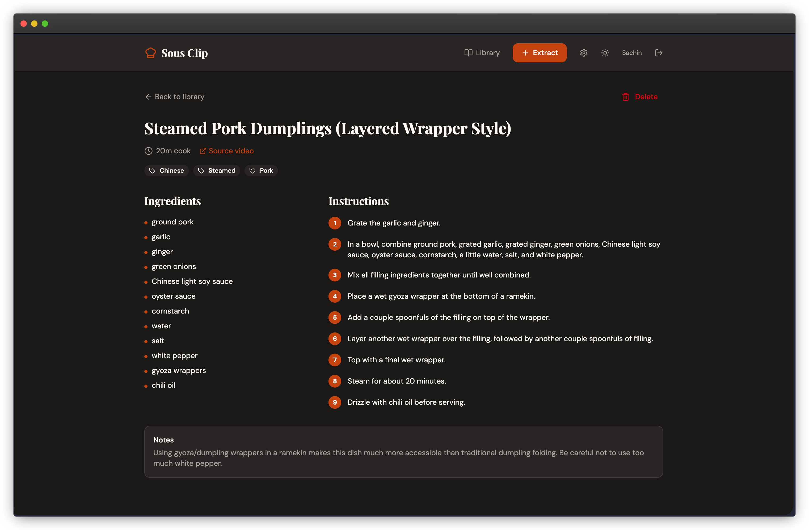

# Sous Clip

> Your recipes. Your server. Forever.

[](LICENSE)
[](docker-compose.yml)

You're scrolling. A recipe catches your eye — someone's making a garlic butter pasta that looks incredible. They rattle off the ingredients, the technique, the timing. You fumble for Notes. By the time you've paused the video, you've already lost half of it.

Every recipe app out there will happily save it for you — on their server, behind their paywall, until they shut down. **Sous Clip** is the only self-hostable, privacy-first recipe extractor built for the short-form video era.

<p align="center">
  
</p>

<p align="center">
  
  
</p>

## Features

- **Any short-form video** — YouTube Shorts, Instagram Reels, TikTok via yt-dlp
- **Local transcription** — Whisper runs on your server (GPU or CPU, auto-detected)
- **Your AI, your key** — Claude, OpenAI, or local Ollama
- **Mobile share sheet** — Install as PWA, share directly from any app
- **Personal recipe library** — Search, tag, browse all your saved recipes
- **Self-hosted forever** — SQLite database, your data never leaves your server

## Quick Start

```bash
git clone https://github.com/yourname/Sous Clip
cd Sous Clip
cp .env.example .env
# Edit .env — set APP_PASSWORD, JWT_SECRET, and your AI API key

# Download the Whisper model (one-time setup)
python scripts/download-model.py

# Start everything
docker compose up -d
```

Open **http://localhost:3000**

> **Whisper model download notes:**
>
> The script requires Python 3 and creates a temporary venv to install `huggingface_hub`. If it fails, make sure `python3-venv` is installed:
>
> ```bash
> # Debian/Ubuntu — required if you see "No module named pip" or "externally-managed-environment"
> sudo apt install python3-venv
> ```
>
> To download a different model size: `python3 scripts/download-model.py medium`
>
> For faster downloads, add a free [Hugging Face token](https://huggingface.co/settings/tokens) as `HF_TOKEN=hf_...` in your `.env` before running the script.

## AI Providers

| Provider | Model | Notes | Requires Key? |
|---|---|---|---|
| Anthropic | claude-sonnet-4-6 | Excellent structured output | Yes |
| OpenAI | gpt-4o | Fast, reliable | Yes |
| Ollama | any local model | Fully offline | No |

Set your provider in `.env` or in the Settings UI.

## Architecture

```
URL → yt-dlp → faster-whisper → AI (Claude/GPT/Ollama) → SQLite
         ↑                                                    ↑
    Temporal Workflow orchestrates each step              Your data
```

- **Backend:** Python + FastAPI
- **Frontend:** React + Vite + TanStack Router + shadcn/ui
- **Queue:** Temporal + Valkey (Redis fork)
- **Database:** SQLite (single file, zero config)
- **Observability:** OpenTelemetry (opt-in)

## GPU Support

The same Docker image works for CPU and GPU. For GPU acceleration:

```yaml
# Uncomment in docker-compose.yml:
deploy:
  resources:
    reservations:
      devices:
        - driver: nvidia
          count: all
          capabilities: [gpu]
```

Whisper configuration in `.env`:

```env
WHISPER_MODEL_SIZE=base    # tiny, base, small, medium, large-v3
WHISPER_DEVICE=auto        # auto, cpu, cuda
WHISPER_COMPUTE_TYPE=auto  # auto, int8, float16, float32
```

## Documentation

- [Configuration Guide](docs/configuration.md)
- [Reverse Proxy Setup](docs/reverse-proxy.md)
- [PWA Installation](docs/pwa.md)
- [Contributing](CONTRIBUTING.md)

## License

MIT
